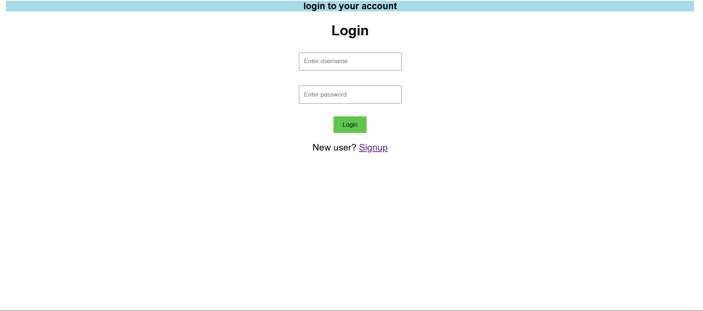
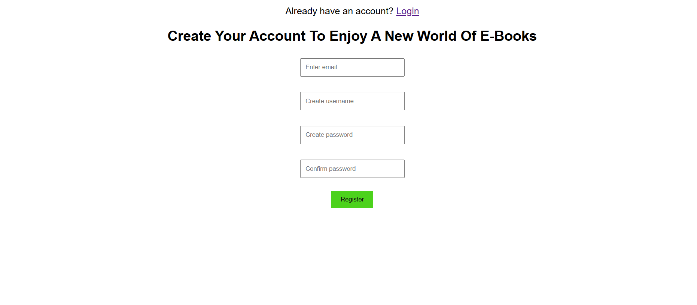
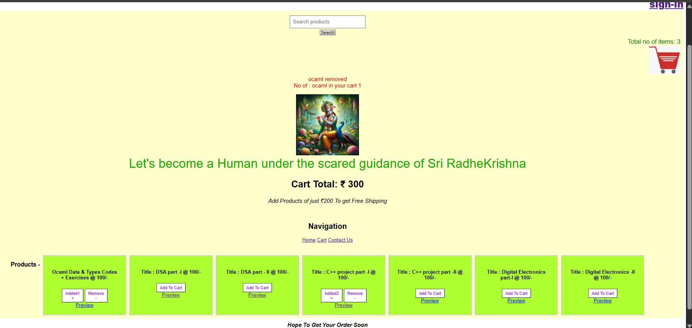
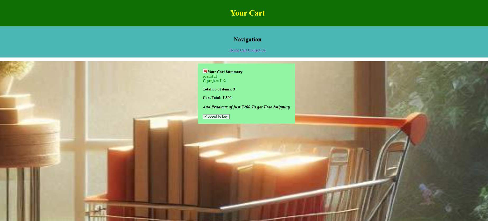
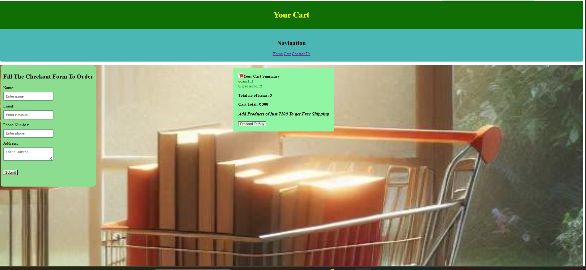
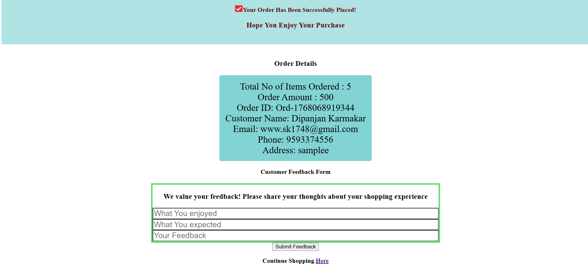
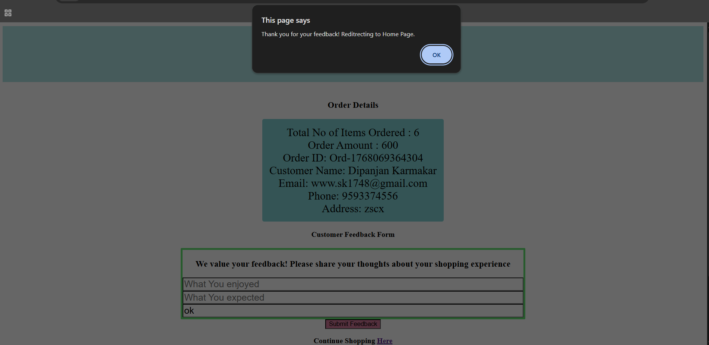

# Fully functional frontend E-Commerce Website Project 

A fully functional frontend e-commerce website built using **HTML, CSS, and Vanilla JavaScript(Main Strength Of The Site)**.  
This project focuses on **core JavaScript logic**, DOM manipulation, and browser storage without using any frameworks.

---
#Live Demo 
https://enggdigital.netlify.app/

## 🚀 Features

- Product listing with Add / Remove  from Cart based on product availability 
- Cart quantity & total price calculation
- Search products and scroll to searched product
- Free delivery indicator based on cart value
- Product preview page with Add Product option 
- Cart Summary & Checkout page (via URL parameters) 
- Contact Us page (via URL parameters)
- Order confirmation page & post order customer feedback
- cart data reset after successful order 
- Sign-up & Login page (only demo)
- Order ID generation using timestamp & order details shown on confirmation page using LocalStorage
- Cart persistence using LocalStorage 
- Login status check (frontend only)
- Responsive layout (basic to intermediate)

---

## 🧠 Concepts Used

- DOM Manipulation
- Event Handling
- Local Storage
- URLSearchParams
- Form Validation
- Array & Object operations
- Conditional rendering
- Frontend state management (without frameworks)
- media query (for mobile friendly behaviour)
---

## Technologies Used
-HTML5
-CSS
-JavaScript(Vanilla)
-LocalStorage

------

## Screenshots 

### Login Page

### Sign Up Page

### Homepage

### Search Product

### Add to Cart

### Product Preview Page

### Cart Page

### Checkout section

### Contact Us Page

### Order Confirmation Page

---
## How to Run Locally
1. Clone or download this repository  
2. Open the project folder in **VS Code**  
3. Right-click any `.html` file (like `index.html`) → **Open with Live Server**  
4. The website will open in your default browser  
5. Test adding products to the cart, searching, and previewing  products 
6. Navigate through different pages using the links provided

-----

## Upcoming Features (Planned)
- Add **User Authentication** and secure login  
- Implement **Order History** for users  
- Connect to a **Backend or Database** for persistent storage  instead of localStorage
- Improve **UI/UX Design** with animations and better layout  using CSS 
- Add **Payment Gateway Integration** 

-----

